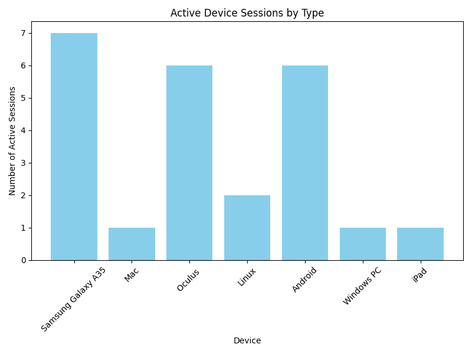

# meta-archive-visualization
The goal of this task is to show some information visualization related to account privacy to a facebook user. This task was done as part of CS204 : Usable Security and Privacy course's Homework 1.

### How to run

After unzipping the facebook's downloaded data, you will have following structure in your root dir(output of ```tree -L 1```)

. 

├── ads_information 

├── apps_and_websites_off_of_facebook 

├── connections 

├── logged_information 

├── personal_information 

├── preferences 

├── security_and_login_information 

└── your_facebook_activity

Now, unzip the zip file in this dir and you will see some python scripts and a shell script <u>run.sh</u> and a requirements file. Run the following commands to see some images and files generated, which are described below.

```shell
pip install -r requirements.txt
./run.sh
```


- active_device_sessions_bar_chart.png

  

This image identifies which devices are most frequently used to access the account. A large number of sessions from unknown devices could indicate potential security risks.

- login_locations_map.html

  

  You can zoom in and see the exact locations where your account is currently logged in. I ahve used some dummy data as well, apart from the exact location of Irvine.

- device_app_network_graph

  

  It's a Network Graph of Device-App Relationship. Nodes represent devices and apps. Edges represent the connection between devices and the apps they access.

  Helps users see which apps are accessed from multiple devices(ex : chrome) or shared between locations.


- targeting_methods_pie_chart.png

  


​	Show the proportion of advertisers that use one, two, or all   three methods of targeting, offering a quick summary of advertiser behavior. It includes all the advertisers that user is being tracked by.

- events_by_platform_bar_chart.png

  

  Count the total number of events for each platform (name) and display them in a bar chart.

  This gives a quick overview of which 3rd party platforms the user interacts with the most via Facebook.

- Connected_app_duration_status.png

  

  It provides insights into apps and websites connected to the user's Facebook account. These visualizations can help users understand their privacy exposure and take action if needed.

- 2FA Status

  A file named 2FA status will also be created which displays whether 2 factor authentication is enabled in user's facebook account.
